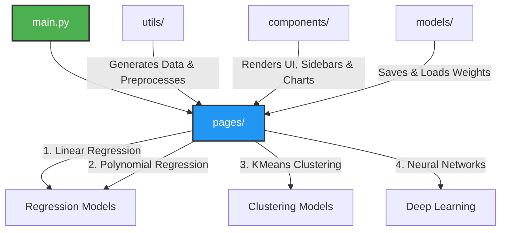
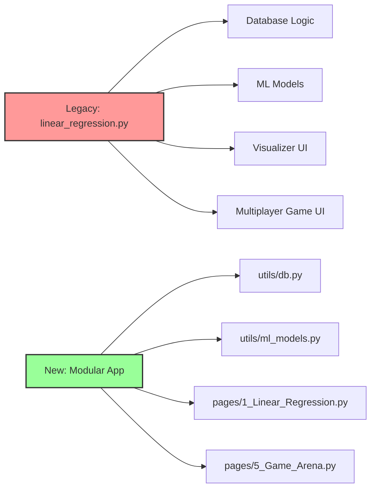

# Streamlit Machine Learning Demo App

An interactive, multi-page Streamlit web application designed to demonstrate and visualize various Machine Learning (ML) algorithms in real-time, including Regression, Clustering, and Neural Networks.

---

## 📌 Project Overview

This repository provides a modular, production-ready blueprint for deploying Machine Learning models via Streamlit. It includes synthetic data generation, dynamic evaluation metrics, interactive charting components, and configurations ready for cloud deployment (via Heroku, Railway, etc.).

### Key Features
* **Multi-Page Navigation:** Separate interactive dashboards for individual ML algorithms.
* **Modular UI Components:** Reusable charts, sidebars, and metric cards to keep code DRY.
* **Production Configurations:** Pre-configured deployment files (`Procfile`, `railway.json`, `packages.txt`).

---

## 🏗️ Repository Architecture

Below is the workflow and data flow mapping how the app's components interact with each other:



---

## 📂 Directory Structure & Module Breakdown

| Directory/File | Description | Key Contents / Responsibility |
| --- | --- | --- |
| **`app/`** | Core application root | Houses all application logic, views, and assets. |
| ├── `main.py` | App Entry Point | The main landing page launching the Streamlit server. |
| ├── `pages/` | Algorithm Dashboards | Dedicated UIs for Linear/Poly Regression, KMeans, and NNs. |
| ├── `components/` | Reusable UI Elements | `charts.py` (plotting), `sidebar.py`, and `metrics.py`. |
| ├── `utils/` | Helper Utilities | Synthetic `data_generator.py`, preprocessing, and model loading. |
| ├── `models/` | Model Storage & Logic | Saved weights (`trained_models/`) and training logic scripts. |
| ├── `assets/` | Static Styling | Images, custom CSS overrides, and UI animations. |
| └── `config/` | Application Settings | Global variables, model hyperparameter bounds, and themes. |
| **`requirements.txt`** | Python Dependencies | Standard pip package management file. |
| **`Procfile` / `railway.json**` | Deployment Configs | Orchestration setups for platform hosting (Heroku / Railway). |
| **`packages.txt`** | System Dependencies | Apt-get packages required for Linux environments (e.g., OpenCV, Graphviz). |

---

## 📊 Codebase Distribution Analysis

The following chart illustrates the functional focus of the codebase files within the `app/` ecosystem, showcasing the architectural split between UI logic, ML modeling, and backend utilities:

```text
[Module Type]     [File Count Allocation]
──────────────────────────────────────────────────────────
Pages / Views     ■■■■■■■■■■■■■■■■■■ 4 Files (25%)
Utilities         ■■■■■■■■■■■■■■■■■■ 4 Files (25%)
UI Components     ■■■■■■■■■■■■■ 3 Files (18.75%)
Models / Logic    ■■■■■■■■■■■■■ 2 Files (12.5%)
Configuration     ■■■■■■■■■■■■■ 2 Files (12.5%)
Main Entry        ■■■■ 1 File (6.25%)
──────────────────────────────────────────────────────────
Total Monitored App Components: 16 Files (100%)

```
## Later updated to modular form: From Monolithic to Modular Architecture as can see below: 
8. Monolithic Architecture Refactoring

**Problem:** All code (database logic, machine learning math, Streamlit UI, and game logic) was originally housed in a single, massive file (`linear_regression.py`). 

**Cause:** As the application grew from a simple educational visualizer into a multiplayer game, a monolithic file became too difficult to maintain, read, and debug.



<details>
<summary><b>Click to show new directory structure</b></summary>

**Solution:** The codebase was refactored into a modular architecture. Core utilities like database connections and machine learning math were extracted into their own specialized files inside a `utils/` folder. The front-end views were split into separate Streamlit pages inside a `pages/` folder.

**New Modular Structure:**

```text
streamlit_ml_demo/
│
├── .env
├── app/
│   ├── utils/
│   │   ├── db.py            <-- (NEW) All database connection logic goes here
│   │   └── ml_models.py     <-- (NEW) All machine learning math goes here
│   │
│   ├── pages/
│   │   ├── 1_Linear_Regression.py  <-- Only the educational visualizer
│   │   └── 5_Game_Arena.py         <-- Only the multiplayer game
│   │
│   └── main.py              <-- A simple welcome page
```
</details>


---

## 🚀 Getting Started

### 1. Prerequisites

Ensure you have Python 3.9+ installed.

### 2. Installation & Setup

Clone the repository, create a virtual environment, and install the required dependencies:

```bash
# Navigate to project root
cd streamlit_ml_demo

# Create and activate virtual environment
python3 -m venv .venv
source .venv/bin/activate  # On Windows use: .venv\Scripts\activate

# Install required dependencies
pip install -r requirements.txt

```

### 3. Running the App Locally

Launch the application server using the following command:

```bash
streamlit run app/main.py

```