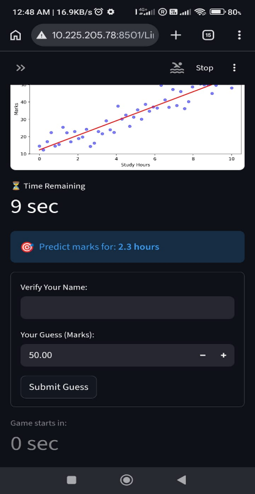
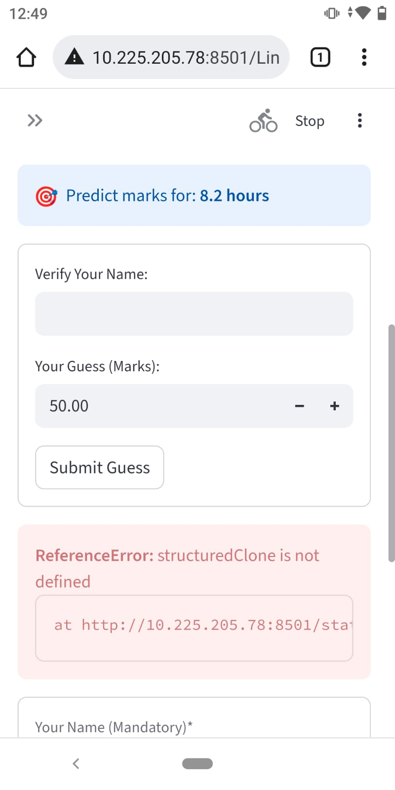
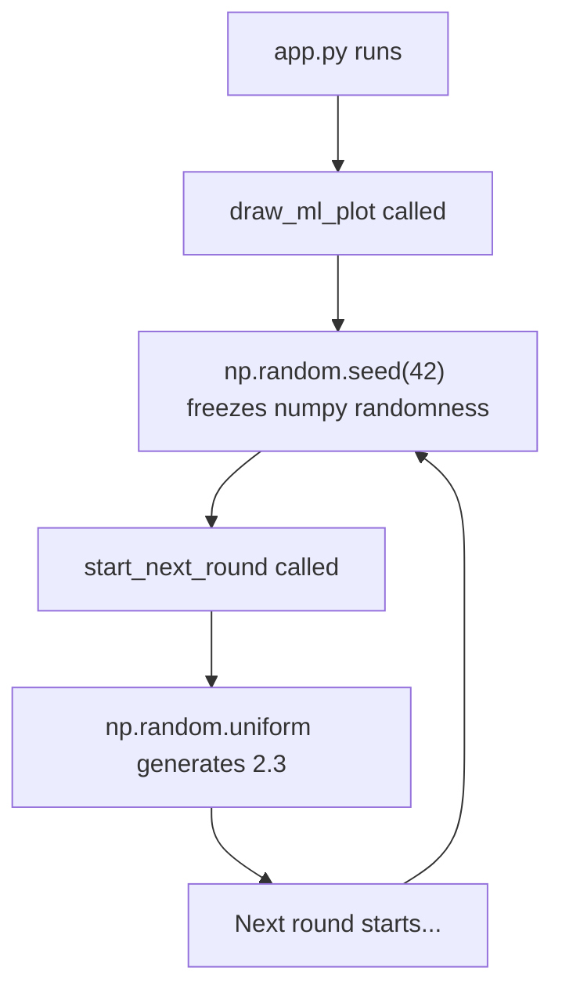
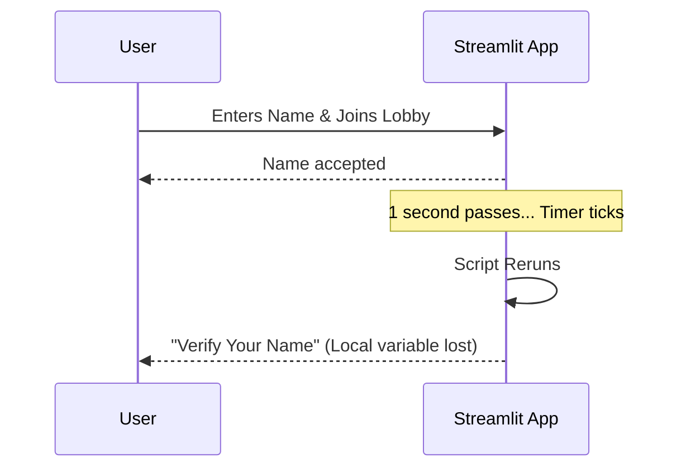
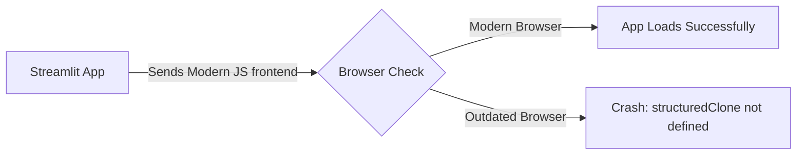
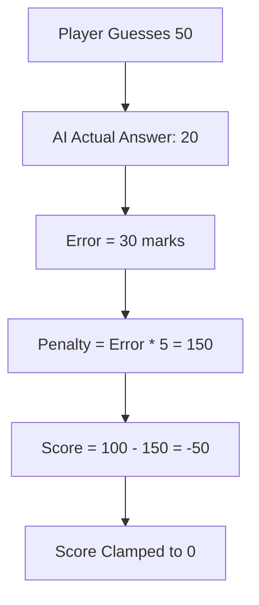
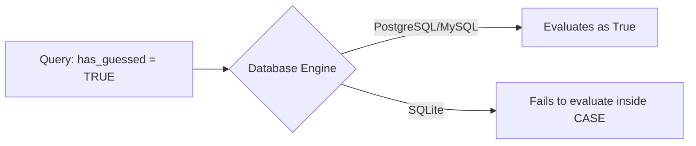
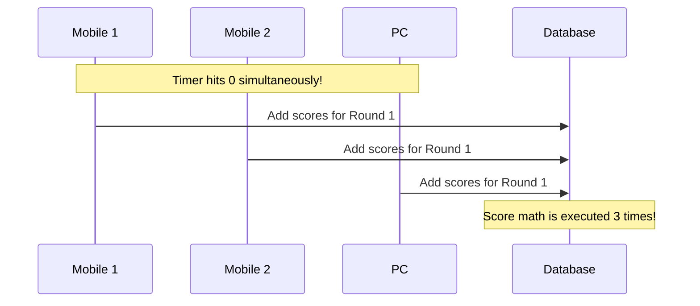
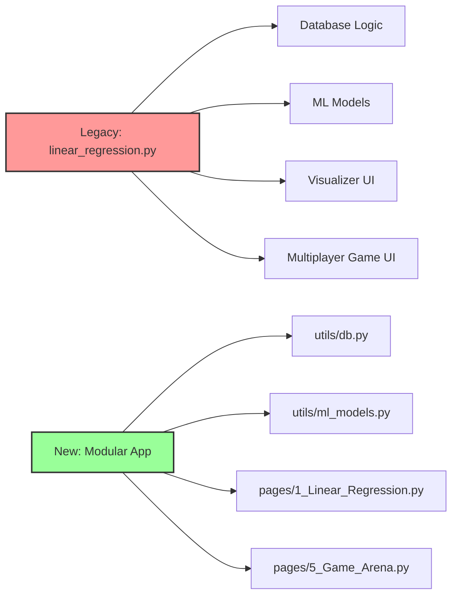
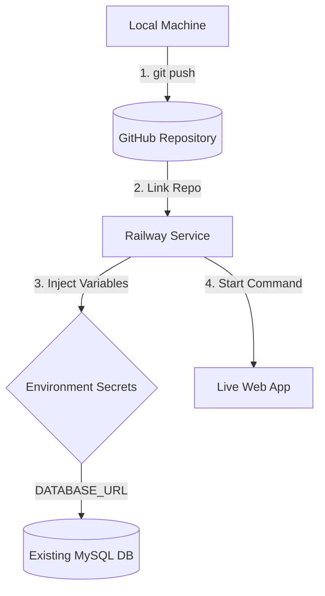

# Problems and Solutions Encountered During Development

This document outlines three specific technical issues encountered during the development of the Streamlit multiplayer application and their respective solutions.

<p float="left">
  
  
</p>

## Summary

| Issue | Cause | Solution |
| :--- | :--- | :--- |
| **Global Seed Bug** | `np.random.seed(42)` froze all randomness globally | Use Python's built-in `random` module for game logic |
| **Repeated Name Verification** | Streamlit re-runs script on each refresh, dropping local variables | Store user name in `st.session_state` to persist across re-runs |
| **`structuredClone` ReferenceError** | Client's mobile browser is too old (Chrome < 98, Safari < 15.4) | Update the client's web browser |
| **Harsh Scoring Penalty** | Math formula `100 - (Error * 5)` resulted in `0` for errors > 20 | Update math to `100 - ABS(guess - actual)` for a 1-to-1 penalty |
| **SQLite Boolean Quirk** | SQLite doesn't reliably recognize `TRUE` inside `CASE` statements | Use `1` instead of `TRUE` (`has_guessed = 1`) |
| **Missing Teacher Control** | Teacher lacked a way to abort a live game in case of errors/distractions | Add an "Emergency Stop" button visible only during active games |
| **Desynced Scores (Race Condition)** | Multiple clients auto-calculated scores at the exact same millisecond | Introduce an Atomic Lock (`status='processing'`) on the database |
| **Monolithic Architecture** | All code (UI, DB, ML) was crammed into a single file | Refactored into a modular project structure using `utils/` and `pages/` |

---

## 1. The Global Seed Bug (Always choosing 2.3 hours)

**Problem:** The app always picked the same random study hour (2.3) every round.

**Cause:** The graph drawing function used `np.random.seed(42)` to stop graph dots from jumping around. However, this is a **global** setting, meaning it froze all numpy randomness in the app.



<details>
<summary><b>Click to show solution</b></summary>

**Solution:** Use Python's built-in `random` library for the game logic, which isn't affected by numpy's global seed.

**Code Changes:**

Add the import at the top of the file:
```python
import random
```

Update `start_next_round` (around line 69):
```diff
- target = round(np.random.uniform(state['min_hour'], state['max_hour']), 1)
+ target = round(random.uniform(state['min_hour'], state['max_hour']), 1)
```
</details>

---

## 2. Session State Forgetfulness ("Verify Your Name")

**Problem:** Users are asked to "Verify Your Name" every round.

**Cause:** Because the app refreshes every second to keep the timer ticking, Streamlit essentially "forgets" local variables. It doesn't use cookies by default.



<details>
<summary><b>Click to show solution</b></summary>

**Solution:** Use `st.session_state` to save the student's name when they join the lobby, and inject it into the box during game rounds.

**Code Changes in Student Dashboard:**

Joining phase:
```diff
  if st.form_submit_button("Join Game"):
      if name:
          with engine.connect() as conn:
              try:
                  conn.execute(text(f"INSERT INTO ..."))
                  conn.commit()
+                 # NEW: Save the name in session memory!
+                 st.session_state['student_name'] = name 
                  st.success("Joined! Waiting for game to start...")
              except:
+                 # If they rejoin after accidentally refreshing, save name anyway
+                 st.session_state['student_name'] = name
                  st.success("Welcome back! Waiting for game to start...")
```

Playing phase:
```diff
  with st.form("guess_form"):
-     name = st.text_input("Verify Your Name:")
+     # NEW: Auto-fill the name using the saved session state!
+     saved_name = st.session_state.get('student_name', '')
+     name = st.text_input("Verify Your Name:", value=saved_name)
      guess = st.number_input("Your Guess (Marks):", 0.0, 150.0, 50.0)
```
</details>

---

## 3. Browser Compatibility (`structuredClone` Error)

**Problem:** Crash with error `ReferenceError: structuredClone is not defined`.

**Cause:** The user's mobile browser is outdated. `structuredClone` is a modern JavaScript function used by Streamlit's frontend (requires Chrome 98+ or Safari 15.4+).



<details>
<summary><b>Click to show solution</b></summary>

**Solution:** This is a client-side issue, not a code issue. 
Update Google Chrome (or the respective browser) from the App Store / Google Play Store on the affected mobile device.
</details>

## 4. problem 2: The Harsh Scoring Penalty (Everyone gets 0)


**Problem:** Every player was getting a score of `0` unless their guess was practically perfect.

**Cause:** The penalty calculation `100 - (Error * 5)` was too aggressive. Since actual marks range from 16-57, a default guess of 50.0 against an answer of 20.0 yields an error of 30. A 30-point error caused a 150-point penalty, resulting in a negative score (which the game clamped to 0).



<details>
<summary><b>Click to show solution</b></summary>

**Solution:** Make the scoring forgiving by deducting just 1 point for every 1 mark the player is off. 

**Code Changes:**
(See the combined code block in the next section for the update to `score_current_round`)
</details>

---

## 5. The SQLite Boolean Quirk

**Problem:** The game logic wasn't consistently recognizing when a user had guessed.

**Cause:** The local database is SQLite, which stores booleans as `1` and `0`. Inside `CASE` statements, SQLite sometimes struggles to evaluate the `TRUE` keyword unless explicitly cast.



<details>
<summary><b>Click to show solution</b></summary>

**Solution:** Change `has_guessed = TRUE` to `has_guessed = 1` for cross-database compatibility.

**Combined Code Changes for #4 and #5:**

Replace the `score_current_round` function (around line 87):

```python
def score_current_round(conn, state):
    # More forgiving scoring: 100 points max. Deduct 1 point for every 1 mark they are off.
    # We use has_guessed = 1 to guarantee it works on both SQLite and MySQL.
    conn.execute(text(f"""
        UPDATE players 
        SET total_score = total_score + CASE 
            WHEN has_guessed = 1 AND (100 - ABS(current_guess - {state['actual_answer']})) > 0 
            THEN ROUND(100 - ABS(current_guess - {state['actual_answer']}), 1)
            ELSE 0 
        END
    """))
```
</details>
---

## 6. Missing Teacher Control (Emergency Stop)

**Problem:** The teacher lacked a way to restart or abort the game if a class got distracted or a student entered a wrong name. 

**Cause:** The Teacher Dashboard only allowed controls during the setup phase or when the game was completely finished. There was no control available during the active `joining` or `playing` phases.

```mermaid
graph TD
    A[Teacher Dashboard] --> B{Game Status?}
    B -- "setup" or "finished" --> C[Show Setup Controls]
    B -- "joining" or "playing" --> D[Show Emergency Stop Button]
    D --> |Click| E[Reset DB & Kick Players]
    E --> C
```

<details>
<summary><b>Click to show solution</b></summary>

**Solution:** Add a prominent "Emergency Stop" button to the Teacher Dashboard that only appears when a game is running. Clicking it will reset the game state back to setup and clear the player list.

**Code Changes in `app.py`:**

Insert the stop button code under the Teacher Dashboard title (around line 115):

```python
    # --- TEACHER DASHBOARD ---
    st.title("👨‍🏫 Game Control Center")
    
    # --- NEW: EMERGENCY STOP BUTTON ---
    if state['status'] in ['joining', 'playing']:
        if st.button("🛑 Stop Game & Return to Setup", type="primary"):
            with engine.connect() as conn:
                # Reset the game state back to setup and kill the timer
                conn.execute(text("UPDATE game_state SET status='setup', timer_ends_at=0 WHERE id=1"))
                # Optional but recommended: Kick everyone out of the lobby so it's clean for the next try
                conn.execute(text("DELETE FROM players"))
                conn.commit()
            st.rerun()
    # ----------------------------------

    if state['status'] == 'setup' or state['status'] == 'finished':
```
</details>

---

## 7. Inconsistent Score Display Across Devices

**Problem:** Different devices (e.g., two mobiles) display different scores for players who are playing together simultaneously. The host PC matches the score on only one of the mobile devices.

**Cause:** A **Race Condition** caused by the auto-refreshing mechanism. Every connected device (PC and mobiles) realized the timer hit `0` at the exact same millisecond. As a result, all devices simultaneously sent a request to the database to calculate the scores. The database ran the `total_score = total_score + points` math *multiple times* for a single round. The devices that refreshed slightly earlier or later showed different out-of-sync final totals.



<details>
<summary><b>Click to show solution</b></summary>

**Solution:** Implement an **Atomic Lock**. When the timer hits zero, the very first device to reach the database will change the status to `processing`. The other devices will be blocked from doing the math because the status is no longer `playing`.

**Code Changes:**

Replace the `check_and_transition_state()` function (around line 82) with this version:

```python
def check_and_transition_state():
    with engine.connect() as conn:
        state = pd.read_sql("SELECT * FROM game_state WHERE id = 1", conn).iloc[0]
        now = time.time()
        
        # If timer is running and time is up (and not already being processed)
        if state['timer_ends_at'] > 0 and now >= state['timer_ends_at'] and state['status'] != 'processing':
            
            # --- NEW: ATOMIC RACE CONDITION LOCK ---
            # We attempt to lock the database by setting it to 'processing'.
            # Only ONE device will successfully do this; the others will be rejected.
            lock_query = text(f"UPDATE game_state SET status = 'processing' WHERE id = 1 AND status = '{state['status']}'")
            result = conn.execute(lock_query)
            
            # If rowcount > 0, THIS specific device won the race and is allowed to do the math.
            if result.rowcount > 0:
                if state['status'] == 'joining':
                    player_count = conn.execute(text("SELECT COUNT(*) FROM players")).scalar()
                    if player_count == 0:
                        conn.execute(text("UPDATE game_state SET status='setup', timer_ends_at=0 WHERE id=1"))
                    else:
                        start_next_round(conn, state, 1)
                
                elif state['status'] == 'playing':
                    score_current_round(conn, state)
                    if state['current_round'] >= state['total_rounds']:
                        conn.execute(text("UPDATE game_state SET status='finished', timer_ends_at=0 WHERE id=1"))
                    else:
                        start_next_round(conn, state, int(state['current_round']) + 1)
                
                conn.commit()
                return True
    return False
```
</details>

---

## 8. Monolithic Architecture Refactoring

**Problem:** All code (database logic, machine learning math, Streamlit UI, and game logic) was originally housed in a single, massive file (`linear_regression.py`). 

**Cause:** As the application grew from a simple educational visualizer into a multiplayer game, a monolithic file became too difficult to maintain, read, and debug.



<details>
<summary><b>Click to show new directory structure</b></summary>

**Solution:** The codebase was refactored into a modular architecture. Core utilities like database connections and machine learning math were extracted into their own specialized files inside a `utils/` folder. The front-end views were split into separate Streamlit pages inside a `pages/` folder.

**New Modular Structure:**

```text
streamlit_ml_demo/
│
├── .env
├── app/
│   ├── utils/
│   │   ├── db.py            <-- (NEW) All database connection logic goes here
│   │   └── ml_models.py     <-- (NEW) All machine learning math goes here
│   │
│   ├── pages/
│   │   ├── 1_Linear_Regression.py  <-- Only the educational visualizer
│   │   └── 5_Game_Arena.py         <-- Only the multiplayer game
│   │
│   └── main.py              <-- A simple welcome page
```
</details>

---

# Phase 2: Deployment Guide (Git & Railway)

> **Objective:** Now that the local application works perfectly, the next phase involves pushing the code to Git and deploying the Streamlit web application and SQL database onto Railway.

## Deployment Pipeline Overview

Deploying the modular Streamlit application to Railway involves pushing the code to GitHub, linking it to a new Railway project, configuring the environment variables to connect to your existing MySQL database, and setting the proper start command.



<details>
<summary><b>Click to show step-by-step deployment instructions</b></summary>

### 1. The Pre-Flight Checklist

Before pushing to GitHub, you need to tell Railway what to install and what to ignore.

**Create a `.gitignore` file** (to hide passwords):
```text
.env
__pycache__/
*.pyc
.venv/
venv/
```

**Create a `requirements.txt` file** (to install dependencies):
```text
streamlit
pandas
numpy
SQLAlchemy
python-dotenv
scikit-learn
matplotlib
pymysql
```
*(Note: `pymysql` is the standard driver SQLAlchemy uses for Railway's MySQL databases).*

### 2. Push to GitHub

In your terminal, inside the `streamlit_ml_demo` folder:
```bash
git init
git add .
git commit -m "Production ready modular architecture"
# Go to GitHub and create a new repository, then run:
git remote add origin https://github.com/YOUR_USERNAME/YOUR_REPO_NAME.git
git branch -M main
git push -u origin main
```

### 3. Deploy on Railway

1. Go to your **Railway Dashboard**.
2. Click **New Project** (or Add in an existing environment).
3. Select **GitHub Repo** and choose the repository you just pushed.
*Note: The initial build will fail because it lacks environment variables.*

### 4. Connect the Database & Fix Variables

Give the Streamlit service access to your database and passwords:
1. In your **existing MySQL Database** on Railway, go to the **Connect** tab and copy the **MySQL Connection URL**. Change `mysql://` to `mysql+pymysql://`.
2. In your new **Streamlit Service**, go to the **Variables** tab and add:
   - **`DATABASE_URL`**: `mysql+pymysql://root:your_railway_password...`
   - **`GAME_PASSWORD`**: `ML10X`
   - **`ADMIN_PWD`**: `gem`

### 5. The Start Command & Networking

Tell Railway exactly how to launch the modular app:
1. In the Streamlit service, go to **Settings** > **Deploy**.
2. Under **Custom Start Command**, paste:
```bash
streamlit run app/main.py --server.port $PORT --server.address 0.0.0.0
```
3. Under **Networking**, click **Generate Domain** to get your public URL.

</details>
